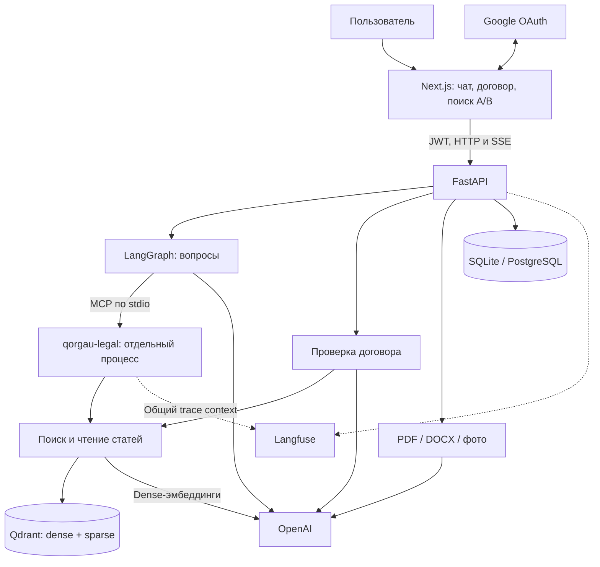
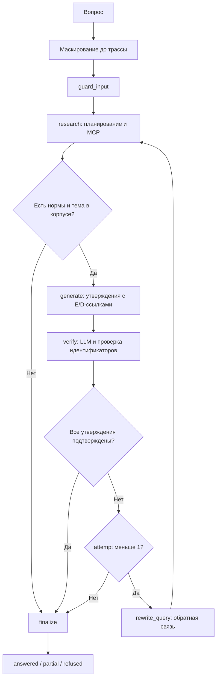

# Архитектура QorgauAI

Состояние реализации: **28.09.2026**. Этот документ описывает код проекта; результаты экспериментов и основания выбора конфигурации — в [EVALS.md](EVALS.md), запуск и скриншоты — в [README.md](README.md).

QorgauAI отвечает по сохранённым текстам Конституции и Трудового кодекса РК и проверяет пункты трудового договора. Система связывает утверждения с найденными источниками, проверяет их отдельным LLM-критиком и убирает неподтверждённые утверждения. Это проверка относительно ограниченного корпуса, а не гарантия юридической правильности.

## 1. Компоненты и границы процессов

| Компонент | Реализация и ответственность |
|---|---|
| Web | Next.js 16, React 19, TypeScript, Tailwind v4, Motion; чат, цитаты, цветная проверка, история, оценки, `/admin` |
| API | [app/main.py](backend/app/main.py), [routes.py](backend/app/api/routes.py): авторизация, квоты, загрузка, SSE, история |
| Агент вопросов | [graph.py](backend/app/agents/graph.py): состояние, условные переходы, генератор и критик |
| MCP | [toolbox.py](backend/app/agents/toolbox.py) и [server.py](backend/app/mcp_tools/server.py): одна долгая stdio-сессия на процесс API |
| Retrieval | [search.py](backend/app/retrieval/search.py): dense, hybrid, полная статья; калькулятор считает в Python |
| Проверка договора | [review.py](backend/app/agents/review.py): отдельный workflow с подбором норм и вердиктами по пунктам |
| Хранение | Qdrant — нормы; SQL — пользователи, запросы, отзывы и чаты; загруженные документы — память процесса |
| Наблюдаемость | [observability.py](backend/app/observability.py): Langfuse, экспортное маскирование; без ключей tracing выключен |

Planner, Generator и Verifier — роли с отдельными промптами внутри одного приложения. MCP работает отдельным дочерним процессом, но не отдельным HTTP-сервисом. A2A-протокола в реализации нет.

## 2. Граф ответа на вопрос

До создания корневого наблюдения Langfuse `answer_question()` маскирует вопрос и передаёт в граф только замаскированный текст, флаг `pii_masked` и категории найденных ПДн. Соответствие меток исходным значениям не входит в состояние.

| Узел | Поведение |
|---|---|
| `guard_input` | Повторно маскирует вход, сохраняет признаки обнаружения ПДн, инициализирует счётчик попыток и журнал инструментов |
| `research` | Выбирает инструменты и запросы; сохраняет сообщения между попытками; завершает поиск через structured tool `finish_research` |
| `generate` | Возвращает `Draft`: список утверждений, ссылки на evidence, недостающие сведения и рекомендацию юриста |
| `verify` | Проверяет каждое утверждение по evidence. Код отклоняет пустые и несуществующие `evidence_ids`, даже если LLM их одобрил |
| `rewrite_query` | Формирует обратную связь о неподтверждённых утверждениях и увеличивает `attempt` |
| `finalize` | Собирает ответ из подтверждённых утверждений; сохраняет удалённые отдельно; формирует источники и дисклеймер |

Переходами управляют Python-функции `route_after_research` и `route_after_verify`. Отдельного LLM-маршрутизатора или сохранённого JSON-плана перед `research` нет: планирование выполняется последовательностью tool calls.

Лимиты из [config.py](backend/app/agents/config.py): четыре обычных итерации планировщика на проход, восемь при приложенном документе, затем дополнительная итерация с принудительным `finish_research`. Одна итерация может содержать несколько tool calls. Повтор после критика разрешён один раз.

Нормы получают идентификаторы `E1…En`, пункты договора — `D<номер>`. Повторяющиеся нормы объединяются по цитате и тексту. Договор без найденной нормы закона не считается достаточным основанием для ответа. Утверждение проходит при `supported=True` и корректных ссылках; отдельный числовой порог `confidence` не используется.

SSE `/ask/stream` передаёт `step`, `tool`, `verified`, затем `final` или `error`. Закрытие соединения отменяет задачу; уже учтённые расходы записываются в журнал.

## 3. Корпус и поиск

### Зафиксированные источники

| Документ | Редакция корпуса | Фрагменты | Статьи с фрагментами |
|---|---|---:|---:|
| Конституция РК | Первоначальная, принята 15.03.2026 | 425 | 96 |
| Трудовой кодекс РК | 06.09.2026 | 1675 | 224 |
| **Всего** | | **2100** | **320** |

PDF сохранены с «Әділет». Даты, официальные ссылки и дата проверки записаны в [meta.json](backend/data/raw/meta.json); происхождение описано в [README корпуса](backend/data/raw/README.md). Это статический снимок: автоматического обновления законодательства нет.

[Парсер](backend/app/ingestion/parse_corpus.py) использует структуру раздел → глава → статья → пункт → подпункт и особенности шрифта PDF. Сноски об истории поправок и повторяющиеся колонтитулы удаляются. Чанки проходят проверку [JSON Schema](backend/app/ingestion/chunk_schema.json) и сохраняются в JSONL с полями `text`, `code`, `chapter`, `article`, `article_number`, `chunk_index`, `point`, `chunk_type`, `source`.

### Retrieval

1. Dense: `text-embedding-3-large`, 3072 измерения.
2. Sparse: локальная `Qdrant/bm25`; русский Snowball-стемминг применяется и к корпусу, и к запросу.
3. Hybrid: Qdrant получает по 20 кандидатов из двух ветвей и объединяет их через RRF, то есть по рангам, без прямого сравнения dense- и sparse-оценок.
4. Поиск исключает `repealed` и `fragment`, чтобы отменённые нормы и короткие обрывки не занимали выдачу. Фильтрация не удаляет их из корпуса.
5. `get_article(code, article_number)` возвращает пункты по `chunk_index`, включая фрагменты, исключённые из поиска. Это получение полного контекста статьи без отдельного parent-child индекса.

MCP-инструмент `search_legal_corpus` ограничивает `top_k` диапазоном 1–10. При `rerank=True` он получает 20 кандидатов и использует `BAAI/bge-reranker-v2-m3`. В агенте флаг задаётся `AGENT_RERANK`, скрыт от планировщика и **по умолчанию выключен**. Дополнительные зависимости вынесены в [requirements-rerank.txt](backend/requirements-rerank.txt) и не устанавливаются основным Dockerfile.

Индексатор [index_corpus.py](backend/app/retrieval/index_corpus.py) кэширует dense-векторы по модели и тексту. `--refresh-sources` обновляет только `source` совпадающих фрагментов без новых эмбеддингов. `--if-empty` индексирует пустую коллекцию либо пытается исправить даты в существующей; несовпадение содержимого выводит предупреждение и не останавливает запуск API. Для обновления самого текста корпуса требуется индексация, а не смена даты в метаданных.

### Три инструмента MCP

| Инструмент | Результат |
|---|---|
| `search_legal_corpus` | Релевантные нормы с цитатами, текстом и номером статьи |
| `get_article` | Полная статья и `source` с датой редакции |
| `calculate_vacation_days` | База и дополнительные дни отпуска, арифметика и цитаты на нормы |

Схемы инструментов берутся из MCP-сервера, а не дублируются вручную. [Skill юридического поиска](skills/qorgau-legal-research/SKILL.md) позволяет использовать тот же сервер вне веб-приложения.

## 4. Модели и устойчивость вызовов

Здесь указаны **настройки проекта**, а не обещание доступности моделей у провайдера. Каждый узел переопределяется через `<NODE>_MODEL`, `<NODE>_TEMPERATURE`, `<NODE>_REASONING_EFFORT`, `<NODE>_MAX_TOKENS`, `<NODE>_FALLBACKS`.

| Роль / префикс | Модель | temperature | reasoning_effort | max_completion_tokens | Fallback |
|---|---|---:|---|---:|---|
| Planner / `RESEARCH` | gpt-5.4-mini | 0 | не задан | 1500 | gpt-5.4 |
| Ответ / `GENERATOR` | gpt-5.4 | 0 | не задан | 2000 | gpt-5.4-mini |
| Критик / `VERIFIER` | gpt-5.5 | не передаётся | low | 2000 | gpt-5.4 |
| OCR / `VISION` | gpt-5.4 | 0 | не задан | 4000 | gpt-5.5 |
| Пункты / `EXTRACTOR` | gpt-5.4-mini | 0 | не задан | 3000 | gpt-5.4 |
| Договор / `REVIEWER` | gpt-5.4 | 0 | не задан | 6000 | gpt-5.4-mini |
| Судья eval / `JUDGE` | gpt-5.4 | 0 | не задан | 1500 | gpt-5.4-mini |

Малая модель выполняет планирование и извлечение. Генератор gpt-5.4 оставлен как компромисс качества, стоимости и полноты проверки договора по сохранённым экспериментам. gpt-5.5 используется критиком; выбор более дорогого генератора не дал однозначного выигрыша по всем метрикам. Подробности и ограничения сравнения — [EVALS.md](EVALS.md).

[llm.py](backend/app/agents/llm.py) задаёт timeout 40 секунд и один SDK-retry. После ошибки OpenAI API вызывается резервная модель; ошибки авторизации и прав доступа не скрываются fallback. Для резервной модели сохраняется ограничение токенов, но не передаются настройки temperature/reasoning основной модели. Ошибка разбора structured output не гарантирует повтор на резервной модели. `VERIFIER` не переключается автоматически при смене генератора: это независимые настройки.

## 5. Загрузка и цветная проверка договора

```mermaid
flowchart LR
    File[PDF / DOCX / JPEG / PNG] --> Read[Текстовый слой / Word / Vision OCR]
    Read --> Mask[Маскирование текста]
    Mask --> Extract[EXTRACTOR: пункты и темы]
    Extract --> Norms[Полные статьи по темам и hybrid-поиск]
    Norms --> Judge[REVIEWER: вердикты по пунктам]
    Judge --> Verify[VERIFIER: красные и жёлтые]
    Verify --> Code[Проверка ссылок и сборка результата]
    Code --> UI[Цвет, объяснение, нормы, предложение правки]
```

[Ingestion](backend/app/ingestion/documents.py) определяет формат по содержимому файла. Ограничения: 10 МиБ, до 10 страниц PDF; для DOCX — до 60 000 извлечённых символов. Формат `.doc` не поддерживается.

PDF-страница с текстовым слоем не менее 50 символов читается PyMuPDF. Остальные страницы рендерятся в 200 dpi и передаются Vision-модели. Word читается через `python-docx`: абзацы и таблицы в порядке документа. Автоматическая нумерация списков Word может потеряться. После маскирования EXTRACTOR возвращает Pydantic `DocumentFindings` с пунктами и темами.

Workflow `review_document()` выполняется отдельно от LangGraph вопросов. Он берёт до 40 пунктов, отбрасывает короткие заголовки разделов, добавляет полные статьи по карте тем (`probation → 36`, `vacation_days → 88`, `termination → 56` и другие), затем делает hybrid-поиск по каждому пункту. Лимиты: top-3 на пункт, top-4 на дополнительный тематический запрос, до 80 evidence, до шести одновременных операций поиска. Результаты разных запросов добавляются по очереди, чтобы один пункт не вытеснил остальные.

| Статус | Значение и условие |
|---|---|
| `violation` — красный | Нарушение имеет существующую ссылку на норму и подтверждение критика |
| `disputed` — жёлтый | Спорный вывод либо красный вердикт, который критик не подтвердил |
| `ok` — зелёный | Противоречий найденным нормам не обнаружено; отдельная повторная проверка зелёных пунктов не выполняется |
| `unchecked` — серый | Reviewer пропустил пункт; он не становится зелёным автоматически |

Для красных и жёлтых пунктов показывается предложенная формулировка `fix`. Она не проходит отдельную проверку критиком как самостоятельная правка. API возвращает признак `truncated`, если договор ограничен лимитом пунктов. SSE передаёт стадии `search/review/verify`, затем вердикты `clause` и итог `final`.

## 6. Безопасность, аккаунты и расходы

**Данные и инструкции.** Вопрос, документ и результаты инструментов оборачиваются в `<untrusted_data>`; промпты запрещают выполнять инструкции из этих блоков. Structured outputs и проверка идентификаторов ограничивают формат ответа. Это защита от части prompt injection, но не доказательство её невозможности.

**Маскирование.** Regex распознаёт ИИН, телефоны, IBAN, e-mail, карты и некоторые ключи API. Вопрос маскируется до корневой трассы и графа; текст документа — до EXTRACTOR и дальнейшей проверки. `mask_otel_spans` дополнительно очищает строковые атрибуты экспортируемых спанов. ФИО, адреса и все возможные варианты записи ПДн этим механизмом не покрыты.

**OCR — отдельная граница.** Исходное изображение передаётся OpenAI для распознавания: извлечь и замаскировать текст можно только после OCR. Изображение не записывается в Langfuse; вместо него фиксируются размер и тип, а текстовый результат маскируется при экспорте. Нельзя заявлять, что любые ПДн никогда не покидают сервер.

**Авторизация.** [Auth.js + Google](frontend/auth.ts) создают веб-сессию; [маршрут token](frontend/app/api/token/route.ts) выдаёт HS256 JWT на один час. Backend проверяет подпись, `exp`, `sub`, issuer `qorgau-web` и audience `qorgau-api`. Роль администратора определяется по `ADMIN_EMAILS` на сервере. При `AUTH_REQUIRED=0` доступен локальный режим с общим пользователем-администратором; при публичном развёртывании требуется `AUTH_REQUIRED=1`.

**Хранение и доступ.** У документов, чатов и отзывов проверяется владелец. Администратору доступны `/admin/stats` и `/admin/users`: таблица пользователей с вопросами, расходами и оценками, личный дневной лимит (1–1000) и блокировка. Заблокированный пользователь получает 403 на любом эндпоинте; администратора заблокировать нельзя. SQL хранит аккаунты, замаскированный журнал запросов, отзывы и JSON истории. История и комментарии не проходят универсальный фильтр ПДн перед сохранением; это не полностью обезличенная база. Загруженные документы хранятся в памяти одного процесса и теряются при перезапуске; TTL и общее хранилище документов не реализованы. История чата сохраняет интерфейс, но не является долговременной памятью агента.

**Квоты.** По умолчанию — 20 учётных операций в день на пользователя (администратор может задать личный лимит) и общий бюджет $5 в день. Вопрос, загрузка и отдельная проверка договора учитываются каждый своей записью. Администратор освобождён от личного лимита, но не от общего. День определяется по UTC. Превышение уже учтённого лимита даёт HTTP 429 до начала нового workflow.

Квота не резервирует бюджет атомарно: параллельные запросы и уже начатая работа могут превысить порог. Счётчик оценивает расходы chat/OCR по `usage` и локальной таблице цен, без эмбеддингов и инфраструктуры. `/search` не проходит проверку дневной квоты. Лимит eval-run отдельно проверяется перед LLM-вызовами и также допускает превышение из-за уже выполняющихся вызовов.

## 7. Langfuse, развёртывание и проверки

Вопрос объединяется в трассу `answer-question`, проверка договора — в `review-contract`. Наблюдения содержат узлы, поколения, поиск, инструменты, модели, токены и результаты проверки. Через MCP передаётся W3C-контекст в namespaced `_meta` (`ai.qorgau/*`), чтобы инструменты дочернего процесса входили в тот же trace. Отзывы становятся score `user_feedback`; eval-run добавляет метрики к трассам.

Промпты хранятся в файлах репозитория. Langfuse Prompt Management и автоматические визуальные оценки извлечения не реализованы. Langfuse Cloud используется для наблюдения; [отдельный compose](infra/langfuse/docker-compose.yml) содержит вариант самостоятельного развёртывания.

### Docker и Railway

[Compose приложения](infra/docker-compose.yml) запускает Qdrant, backend и frontend. Backend использует Python 3.14 и перед Uvicorn запускает `index_corpus --if-empty`; frontend собирается в Next.js standalone. Локальные порты привязаны к `127.0.0.1`.

В проекте используется Railway с автодеплоем из `main` (зафиксировано в README); для frontend и backend предусмотрены отдельные Dockerfile и `.railwayignore`. Конфигурация сервисов и публичный адрес управляются в Railway, а не в versioned IaC. PostgreSQL поддерживается SQLAlchemy/psycopg; локально используется SQLite. Qdrant должен иметь постоянное хранилище, а frontend — доступный API URL.

| Сервис | Основные переменные |
|---|---|
| Frontend | `NEXT_PUBLIC_API_URL` при сборке; `AUTH_SECRET`, `AUTH_GOOGLE_ID`, `AUTH_GOOGLE_SECRET`, `BACKEND_JWT_SECRET` |
| Backend | `OPENAI_API_KEY`, `QDRANT_URL`, опциональный `QDRANT_API_KEY`, `DATABASE_URL`, `AUTH_REQUIRED=1`, `BACKEND_JWT_SECRET`, `ADMIN_EMAILS`, `ALLOWED_ORIGINS` |
| Лимиты / tracing | `DAILY_QUESTIONS_PER_USER`, `DAILY_BUDGET_USD`, ключи Langfuse и URL инстанса |

JWT-секрет должен совпадать у frontend и backend; OAuth callback относится к публичному origin frontend. Текущая схема хранения загруженных документов рассчитана на один процесс API. Масштабирование на несколько workers требует общего хранилища и маршрутизации сессий.

### Проверки на 28.09.2026

`pytest` — **90 тестов**, CI на `main` зелёный. Полный прогон требует индексированного Qdrant, для двух поисковых тестов — ключа эмбеддингов, для reranker — дополнительных зависимостей и весов; набор без Qdrant (68 тестов) приведён в [EVALS.md](EVALS.md).

[CI](.github/workflows/ci.yml) поднимает Qdrant, индексирует корпус, запускает pytest без `test_rerank.py`, проверяет hybrid Recall@5 ≥ 0.85, затем frontend lint и build. Полные LLM-evals выполняются отдельно из-за стоимости.
