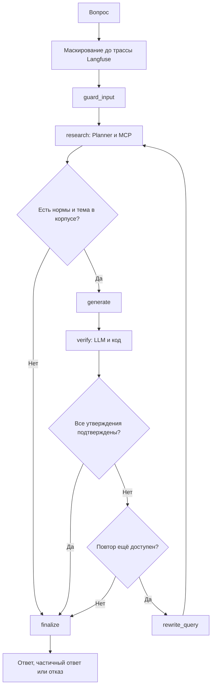

# QorgauAI — Agentic RAG для юридической помощи по законодательству РК

**Статус на 28.09.2026:** реализованный MVP финального проекта буткампа. Защита — демонстрация до 10 минут.
**База:** развитие QorgauRAG, курсового проекта Project Management.
**Материалы для сдачи:** [README со скриншотами](README.md), [ARCHITECTURE.md](ARCHITECTURE.md), [EVALS.md](EVALS.md).

Этот документ фиксирует итоговую реализацию и соответствие требованиям. Настройки и границы системы подробно описаны в ARCHITECTURE, измерения и методика — в EVALS. Будущие возможности вынесены отдельно и не представлены как готовые.

## 1. Идея проекта

QorgauAI помогает находить нормы Конституции и Трудового кодекса РК, отвечать с цитатами и проверять пункты трудового договора. Пользователь задаёт вопрос или загружает PDF, Word (.docx), JPEG либо PNG.

Агент выбирает инструменты поиска, получает контекст статьи, формирует утверждения и проверяет их отдельным критиком. В окончательном ответе остаются только утверждения с существующими источниками, которые подтвердил Verifier. Это информационный помощник по ограниченному корпусу, а не замена юриста.

## 2. Почему этот проект

Исходный QorgauRAG содержал базовый retrieval и tool calling. QorgauAI развивает его в трёх направлениях: управляемый цикл поиска и проверки, отдельный workflow проверки каждого пункта договора, измерение качества и стоимости.

Корпус текущего MVP ограничен двумя документами. Другие кодексы и калькуляторы исходного проекта не входят в заявленную область QorgauAI.

## 3. Проблема baseline RAG

Обычный конвейер «вопрос → один поиск → генератор» может получить похожую, но недостаточную норму, упустить исключение или отказаться от вопроса, ответ на который есть в корпусе.

На сохранённом наборе из 36 вопросов A и B получили среднюю correctness 0.708 и восемь ложных отказов из 31 ожидаемого ответа. C получил 0.931 и ни одного ложного отказа. Correctness учитывает частичные ответы с весом 0.5; это не процент полностью правильных ответов. Источник и знаменатели — [EVALS.md](EVALS.md).

## 4. Архитектура

Три роли — Planner, Generator и Verifier — имеют отдельные промпты и настройки моделей. Условные переходы выполняют `route_after_research` и `route_after_verify`, а не свободное решение LLM. Отдельного предварительного LLM-маршрутизатора нет. Повтор после проверки ограничен одним циклом.

Next.js обращается к FastAPI по HTTP/SSE. Агент вопросов вызывает инструменты отдельного MCP-процесса по stdio. Цветная проверка договора использует отдельный workflow и напрямую вызывает общую retrieval-библиотеку. Полная схема компонентов — [ARCHITECTURE.md](ARCHITECTURE.md).

## 5. User Flow

1. Пользователь входит через Google; в локальном режиме вход можно отключить.
2. Задаёт вопрос либо загружает PDF, DOCX или фото. Перед платным workflow API проверяет квоту.
3. PDF с текстовым слоем читается PyMuPDF; сканы и фото распознаются Vision-моделью; DOCX читается `python-docx`. Затем текст маскируется и разбирается на пункты.
4. В чате отображаются живые шаги агента, вызовы MCP и результат проверки утверждений. Цитата открывает полный текст статьи или пункт договора.
5. Команда проверки договора возвращает отдельную карточку каждого пункта: цвет, объяснение, найденную норму и, для спорных пунктов, предложение правки.
6. История сохраняется в личных чатах. Оценка ответа попадает в статистику и Langfuse; администратор видит расходы, отрицательные отзывы и таблицу пользователей с их вопросами; может задать личный лимит или заблокировать.

Зелёный цвет означает «противоречий найденным нормам не обнаружено». Он не удостоверяет законность договора по всем законам и обстоятельствам.

## 6. Корпус и chunking

| Документ | Редакция корпуса | Чанков | Статей с чанками |
|---|---|---:|---:|
| Конституция РК | Первоначальная редакция от 15.03.2026 | 425 | 96 |
| Трудовой кодекс РК | 06.09.2026 | 1675 | 224 |
| **Всего** | | **2100** | **320** |

Сохранённые PDF и [meta.json](backend/data/raw/meta.json) связывают корпус с официальными источниками «Әділет». Даты проверены 28.09.2026 и перенесены в JSONL. Автоматического мониторинга новых редакций нет.

Парсер сохраняет уровни «раздел/глава → статья → пункт → подпункт» и различает заголовки, основной текст и сноски по форматированию PDF. JSON Schema проверяет поля чанка, включая `article_number`, `chunk_index`, `chunk_type` и `source`. Сноски о поправках удаляются из поискового текста.

Во всех A/B/C используются одинаковые structure-aware чанки. Fixed-size baseline не реализован. Контекст полной статьи получается через `get_article`; отдельного parent-child индекса нет.

## 7. Hybrid Search и reranker

Dense-ветвь использует `text-embedding-3-large` (3072 измерения), sparse — локальный `Qdrant/bm25` с русским Snowball-стеммингом. Qdrant объединяет по 20 кандидатов из ветвей через RRF. Поиск исключает `repealed` и `fragment`; полная статья сохраняет их порядок.

`BAAI/bge-reranker-v2-m3` реализован как опция, но в конфигурации сдачи **выключен** (`AGENT_RERANK=false`). Отдельные зависимости не входят в основной Docker-образ. Сохранённые retrieval-отчёты показывают Recall@5 0.815 у dense и 0.870 у hybrid; фильтрация снижает шум, но не увеличивает Recall@5. Подробности и ограничения ранних экспериментов с reranking — в [EVALS.md](EVALS.md).

## 8. Проверка ответа и договора

### Ответ на вопрос

Generator возвращает список утверждений с `evidence_ids`. Verifier проверяет подтверждение по evidence. Код дополнительно отклоняет пустые и несуществующие ссылки. После одного разрешённого повтора `finalize` удаляет неподтверждённое, формирует `answered`, `partial` или `refused` и прикладывает дисклеймер. Claim-level проверка уже реализована; числовой порог confidence не применяется.

### Проверка договора

[review.py](backend/app/agents/review.py) берёт до 40 пунктов, получает полные статьи по карте тем и выполняет hybrid-поиск по тексту каждого пункта. До 80 фрагментов норм передаются Reviewer. Verifier повторно проверяет красные и жёлтые выводы.

Красный вердикт без существующей нормы и подтверждения критика понижается до жёлтого. Пропущенный Reviewer пункт становится серым `unchecked`. Зелёные пункты и предлагаемые формулировки `fix` не проходят отдельную повторную проверку. Ограничение по числу пунктов отражается в `truncated`.

## 9. Evaluation

Golden dataset: 36 вопросов, семь категорий; 31 ожидаемый ответ и пять отказов. Судья — gpt-5.4 t=0 с явной рубрикой и текстами цитат. Используются собственные метрики; RAGAS в реализации не подключён.

| Метрика основного прогона | A · Dense | B · Hybrid | C · Agentic |
|---|---:|---:|---:|
| Correctness, шкала 0 / 0.5 / 1 | 0.708 | 0.708 | 0.931 |
| Faithfulness | 0.912 | 0.948 | 0.962 |
| Source recall | 0.645 | 0.694 | 0.976 |
| False refusal rate | 0.258 | 0.258 | 0.000 |
| Latency p50 / p95, с | 1.9 / 2.7 | 1.9 / 2.6 | 7.2 / 18.1 |
| $/вопрос, только pipeline | 0.0040 | 0.0042 | 0.0295 |

[Исходный отчёт](backend/data/eval/results/abc-baseline/summary.json), 24.09.2026. В C прирост средней correctness равен 0.223; стоимость относительно A выше примерно в 7.4 раза, медианная задержка — в 3.8 раза.

| Конфигурация C | Correctness | Verdict recall Q&A | $/вопрос |
|---|---:|---:|---:|
| gpt-5.4 t=0, исходный | 0.931 | 0.900 | 0.0295 |
| gpt-5.4 t=0, повтор | 0.917 | 0.800 | 0.0246 |
| gpt-5.4 t=0.7 | 0.917 | 0.900 | 0.0261 |
| gpt-5.5, без temperature | 0.958 | 0.700 | 0.0326 |

Выбраны gpt-5.4 и t=0: температура 0.7 не дала явного выигрыша, а более высокая correctness gpt-5.5 сопровождалась меньшей полнотой вердиктов и большей стоимостью. Двух повторов недостаточно для оценки статистической значимости или доказательства детерминированности t=0.

**Цветная проверка договора оценена отдельно:** два синтетических DOCX, 47 пунктов, три нарушения и 44 законных пункта, включая три ловушки. Найдены 3/3 нарушения, ложных красных 0/44, тревог на ловушках 0/3, пропусков пунктов ключа нет. Стоимость ingestion + review — $0.1135 и $0.0448. Источник: [contract_review.json](backend/data/eval/results/contract_review.json).

**Ограничения:** малая выборка, нет скрытого тестового набора и отдельных ablation по узлам, возможна подгонка промптов; судья может быть смещён. Ноль успешных инъекций относится только к трём атакам. Метрики review и Q&A используют разные наборы и не взаимозаменяемы. Сумма сохранённых затрат четырёх Q&A-прогонов — $5.216; это не полный счёт проекта.

Полные таблицы, формулы, знаменатели, ошибки и команды воспроизведения — [EVALS.md](EVALS.md).

## 10. Observability — Langfuse

Вопрос создаёт корневую трассу `answer-question`, review — `review-contract`. Узлы, инструменты, retrieval, поколения, токены, модели и стоимость видны как отдельные наблюдения. Контекст переносится через MCP `_meta` с префиксом `ai.qorgau/`, чтобы дочерний процесс не создавал несвязанные трассы.

PII-маскирование вопроса выполняется **до корневой трассы**, а экспортный `mask_otel_spans` остаётся дополнительным слоем. Картинки OCR в Langfuse не записываются. Без ключей tracing выключается; тесты не пишут данные в реальный проект. Отзывы записываются как `user_feedback`, eval-метрики — как scores.

Промпты версионируются файлами в Git. Перенос в Langfuse Prompt Management не реализован. [inspect_trace.py](backend/scripts/inspect_trace.py) предназначен для проверки дерева наблюдений и отсутствия заданных строк ПДн.

## 11. Legal Safety и приватность

Ответ ограничен найденными нормами двух документов. Приложение показывает источники, недостающие сведения, удалённые утверждения и дисклеймер. Для спорных случаев предусмотрена рекомендация обратиться к юристу. Автоматический критик тоже может ошибаться.

Regex маскирует ИИН, телефон, IBAN, e-mail, карты и некоторые API-ключи, но не все ФИО, адреса и варианты ПДн. Текст вопроса и документа маскируется до текстовых LLM-шагов. Для OCR исходное изображение передаётся Vision-провайдеру; нельзя обещать, что ПДн никогда не покидают сервер.

Журнал запросов маскируется, но аккаунты, JSON истории и комментарии к отзывам не являются полностью обезличенными. Правила доступа к ним и ограничения хранения описаны в ARCHITECTURE.

## 12. Tech Stack и реализованные решения

### 12.1 Оркестрация агентов

LangGraph, Pydantic structured outputs, две условные развилки и один retry. В `research` до четырёх обычных итераций, до восьми с документом, затем принудительное завершение. Итерация может содержать несколько tool calls. Маршрутизация детерминирована кодом, содержание LLM-ответов — нет.

### 12.2 MCP-сервер и Skill

`qorgau-legal` предоставляет три инструмента: `search_legal_corpus`, `get_article`, `calculate_vacation_days`. Схемы передаются планировщику из сервера. Транспорт приложения — stdio, включая запуск backend в Docker; HTTP MCP не реализован. [Skill](skills/qorgau-legal-research/SKILL.md) описывает использование того же сервера внешним MCP-клиентом.

### 12.3 Данные и ingestion

PyMuPDF — корпус и текстовые PDF; Vision — страницы без текстового слоя и фото; `python-docx` — абзацы и таблицы Word. Ограничения: 10 МиБ, 10 страниц PDF, 60 000 символов DOCX. Формат определяется по байтам. EXTRACTOR возвращает номера, темы и тексты пунктов, которые становятся `D`-фрагментами. Автоматическая нумерация Word может теряться. Документ хранится в памяти одного backend-процесса и имеет владельца.

### 12.4 Chunking

Структурная нарезка на пункты и подпункты, schema validation и типизация отменённых/коротких фрагментов. 2100 чанков сохранены в JSONL. Коррекция `source` переносится в совпадающие payload Qdrant без пересчёта эмбеддингов; несовпадающий текст требует переиндексации.

### 12.5 Retrieval

Qdrant с именованными dense/sparse-векторами, RRF и фильтрами по кодексу и статье. Dense-векторы корпуса кэшируются по модели и тексту. `get_article` возвращает полную статью по порядку. Reranker доступен опционально, выключен по умолчанию.

### 12.6 Выбор LLM и гиперпараметров

| Узел | Модель | Параметры | max_completion_tokens |
|---|---|---|---:|
| RESEARCH | gpt-5.4-mini | temperature 0 | 1500 |
| GENERATOR | gpt-5.4 | temperature 0 | 2000 |
| VERIFIER | gpt-5.5 | reasoning low; temperature не передаётся | 2000 |
| VISION | gpt-5.4 | temperature 0 | 4000 |
| EXTRACTOR | gpt-5.4-mini | temperature 0 | 3000 |
| REVIEWER | gpt-5.4 | temperature 0 | 6000 |
| JUDGE | gpt-5.4 | temperature 0 | 1500 |

Настройки берутся из [config.py](backend/app/agents/config.py) и [judge.py](backend/app/eval/judge.py), переопределяются env. Verifier не меняется автоматически вслед за генератором. Timeout — 40 секунд, один SDK-retry, затем model fallback на поддерживаемых ошибках API; ошибки авторизации не скрываются. Модельный fallback не устраняет общую недоступность провайдера OpenAI.

### 12.7 Guardrails, авторизация и лимиты

Вопросы, договоры и ответы tools оборачиваются в `<untrusted_data>`. Pydantic проверяет формат, код — существование ссылок, Verifier — поддержку утверждения источником. Отдельного LLM-классификатора атак нет.

Google OAuth через Auth.js уже реализован. Frontend выдаёт часовой HS256 JWT; backend проверяет подпись, issuer, audience и срок. `AUTH_REQUIRED=1` включает обязательный вход; локальный режим использует общего администратора. Роль admin определяется серверным списком `ADMIN_EMAILS`.

По умолчанию: 20 операций на пользователя в день (администратор может задать личный лимит или заблокировать пользователя) и общий учтённый бюджет $5, с границей дня по UTC. Вопрос, загрузка и review учитываются отдельно; личный лимит не действует на admin. Проверка выполняется перед workflow, поэтому параллельные и уже начатые запросы могут превысить порог. Учёт стоимости не включает эмбеддинги; `/search` дневной квотой не ограничен.

### 12.8 Observability

Langfuse Cloud, плюс отдельный compose самостоятельного развёртывания. Единые trace/session, узлы, инструменты, поколения, feedback и eval scores. Вопрос очищается до трассы; экспорт очищает строковые атрибуты дополнительно. Промпты остаются в Git.

### 12.9 Evals

Автоматизированы Q&A A/B/C, повтор, температура, замена генератора, retrieval-only и отдельный review договоров. Собственные рубрики учитывают отказ, запрещённые утверждения и вердикты. Visual judge извлечения и оценка независимости чанков остаются будущей работой. Подробный отчёт — [EVALS.md](EVALS.md).

### 12.10 Приложение, деплой и тесты

| Слой | Реализовано |
|---|---|
| Frontend | Next.js 16, TypeScript, Tailwind v4, Motion; чат, живые шаги, цитаты, PDF/DOCX/фото, цвета проверки, поиск A/B, история, темы |
| Backend | FastAPI: `/ask`, `/ask/stream`, `/search`, `/articles`, `/documents`, `/documents/{id}/review`, калькулятор, `/me`, `/feedback`, `/chats`, `/admin/stats`, `/admin/users` |
| SQL | SQLite локально; PostgreSQL через SQLAlchemy/psycopg при развёртывании; пользователи, журнал, отзывы, история нескольких чатов |
| Доступ | Google OAuth, JWT, роли user/admin, проверки владельца документа, чата и оценки; личные лимиты и блокировка пользователей из админки |
| Деплой | Railway, автодеплой из `main`; Dockerfile frontend/backend, `.railwayignore`, настройка origins, Google callback и общих секретов |
| Docker | Qdrant + backend + frontend; `index_corpus --if-empty` при старте; reranker/torch вынесены из основного образа |
| CI | GitHub Actions: индексирование Qdrant, pytest без reranker, hybrid Recall@5 ≥ 0.85, frontend lint и build |
| Тесты | **93 теста** на 29.09.2026, CI на `main` зелёный; проверены граф, PII, метаданные/MCP в тестовой БД, ingestion, review, аккаунты, лимиты и метрики |

Часть тестов требует индексированного Qdrant, ключа эмбеддингов и весов reranker; команды приведены в EVALS. На 28.09.2026 CI на `main` зелёный, а Railway-стенд отвечает `/health` со статусом `ok`.

## 13. Соответствие требованиям курса и MVP Checklist

| Требование | Подтверждение | Статус |
|---|---|---|
| Оркестрация с условной логикой | LangGraph, две развилки, retry ≤ 1 | Готово |
| Собственный MCP с 2–3 tools | `qorgau-legal`, три инструмента | Готово |
| Собственный Skill | `skills/qorgau-legal-research/SKILL.md` | Готово |
| Осознанный RAG | Структурные чанки, dense/BM25, RRF, Qdrant, экспериментальная опция reranker | Готово |
| Документы и мультимодальность | PDF, DOCX, JPEG, PNG; OCR только для страниц, которым он нужен | Готово |
| Трейсинг | Langfuse, общий контекст MCP, маскирование, токены/стоимость, scores | Готово |
| Golden dataset ≥ 30 и ≥ 2 метрики | 36 вопросов; correctness, faithfulness, recall, отказы, latency/cost и другие | Готово |
| A/B-эксперимент | A/B/C, повтор, температура и генератор; сохранённые результаты | Готово |
| Документированный выбор моделей | Конфигурация в ARCHITECTURE, результаты и trade-offs в EVALS | Готово |
| Web frontend | Next.js, чат, документы, цитаты, SSE | Готово |
| Артефакты сдачи | README, ARCHITECTURE, EVALS и этот итоговый документ | Готово |

Дополнительно реализованы: цветная проверка договора, Google OAuth, JWT, личная история, роли, лимиты, отзывы, админ-статистика, Docker, CI и Railway-деплой. Аутентификация и деплой больше не относятся к отложенным возможностям.

В MVP не входят голосовой интерфейс, fine-tuning, внешние государственные интеграции и действия от имени пользователя. Внешние сервисы OpenAI, Google OAuth и Langfuse уже используются; утверждение «внешние API не берём» к текущей реализации неприменимо.

## 14. Future Work

- Расширение корпуса и автоматический контроль редакций с версионированием источников.
- Независимый скрытый датасет, повторные прогоны, доверительные интервалы и ablation по узлам.
- Отдельная оценка OCR/структуры документа; проверка зелёных пунктов и предлагаемых правок договора.
- Более полное распознавание ПДн, правила хранения истории и отзывов, TTL документов.
- Общее хранилище документов для нескольких workers; атомарное резервирование квот и полный учёт расходов.
- Parent-child индекс и GraphRAG, если отдельные измерения покажут пользу.
- HITL с практикующим юристом для спорных выводов; интеграции и Telegram при наличии продуктовой задачи.

Claim-level verification, получение полной статьи через `get_article`, аккаунты, история чатов и деплой уже сделаны. История интерфейса при этом не является долговременной памятью агента.

## 15. Демонстрация на защите

Лимит — 10 минут. Данные договоров для показа — синтетические.

1. **1 минута:** проблема пользователя и baseline A/B на сохранённом примере. В интерфейсе сравнивается поиск A/B; полные ответы A/B/C показываются из eval-отчёта.
2. **2 минуты:** тот же сложный вопрос в Pipeline C, шаги и инструменты, цитата и полный текст статьи.
3. **1.5 минуты:** загрузка DOCX либо фото/скана, пункты и цветная проверка; показать красный пункт с нормой и законную ловушку.
4. **1 минута:** Langfuse того же вопроса — маскирование, Planner/Generator/Verifier, tools, токены и стоимость. Reranker не обещается в трассе, поскольку выключен.
5. **1 минута:** MCP-сервер и Skill во внешнем клиенте; поиск нормы и полная статья с датой редакции.
6. **1.5 минуты:** таблицы EVALS: A/B/C, температура, модели, отдельный review; объяснить цену улучшения и размер выборки.
7. **1 минута:** Google-вход, личная история, оценка ответа и админ-статистика; границы юридической помощи и дальнейшая работа.

Тезис защиты: управляемый поиск и проверка утверждений улучшили качество на сохранённом наборе, при этом проект показывает источники, стоимость и известные ограничения.

## 16. Итог реализации

За проект реализованы корпус и retrieval, MCP и Skill, LangGraph с проверкой и retry, мультимодальный ingestion, A/B/C-оценка, веб-интерфейс и наблюдаемость. Затем добавлены DOCX, отдельная цветная проверка, авторизация, история, квоты, feedback, админ-страница и деплой.

Заключительные исправления: вопрос маскируется до Langfuse, даты редакций заменены на проверенные, обработанные фрагменты синхронизированы с метаданными, подготовлены ARCHITECTURE и EVALS. Обновление `source` уже существующего Qdrant поддерживается отдельной командой и стартовым индексатором.

Для защиты используются сохранённые eval-результаты и актуальные описания реализации. Команды проверки и зависимости для повторного прогона перечислены в EVALS.

## 17. Принцип проекта

QorgauAI помогает найти и объяснить норму, показывает основание вывода и умеет ограничить ответ. Подтверждение источником и автоматический критик снижают часть ошибок, но не заменяют юридическую экспертизу.
