<div align="center">


# QorgauAI

**Юридический помощник по Конституции и Трудовому кодексу РК, у которого каждое утверждение подкреплено статьёй закона.**<br>
Agentic RAG на LangGraph: агент ищет нормы через MCP-инструменты, второй агент проверяет каждое утверждение, и в ответ попадает только то, что подтвердилось.

[](https://github.com/Abegerov4/QorgauAI/actions/workflows/ci.yml)


</div>

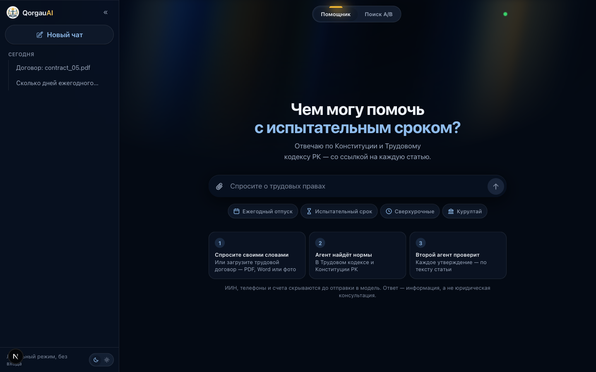

## Проблема за 20 секунд

Работнику, которому дали договор с отпуском 14 дней или испытательным сроком на полгода, нужен ответ **«можно так или нельзя — и где это написано»**. Обычный чат-бот отвечает уверенно, но по памяти: придумывает номера статей, путает Трудовой кодекс РК с российским и не отличает «для всех» от «для руководителей».

Простой RAG помогает лишь наполовину. Он находит похожие фрагменты, но не проверяет, подтверждают ли они ответ. На нашем наборе из 36 вопросов он правильно отвечает в **71%** случаев, а на каждый четвёртый вопрос, на который ответ в законе есть, отказывается отвечать.

**QorgauAI** ищет нормы как исследователь: несколько поисков, чтение статьи целиком, калькулятор. Потом пишет ответ, где у каждого утверждения есть ссылка, и отдаёт его **второму агенту на проверку**. Всё, что не подтвердилось текстом статьи, из ответа убирается. Правильных ответов становится **93%**, ложных отказов — ноль.

## Что умеет

### 1. Ответ, где у каждого предложения есть статья

Ответ состоит из утверждений, под каждым — ссылка на норму. При наведении на ссылку всплывает текст процитированного пункта, по клику открывается вся статья, и нужный пункт в ней подсвечен.

<table>
<tr>
<td width="50%">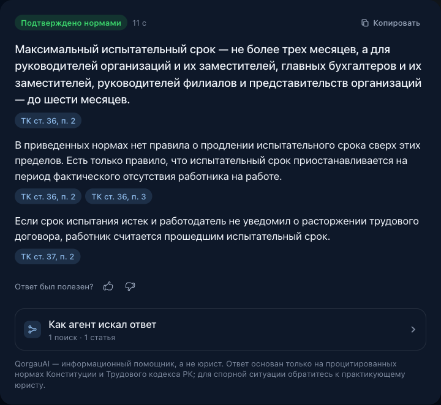</td>
<td width="50%">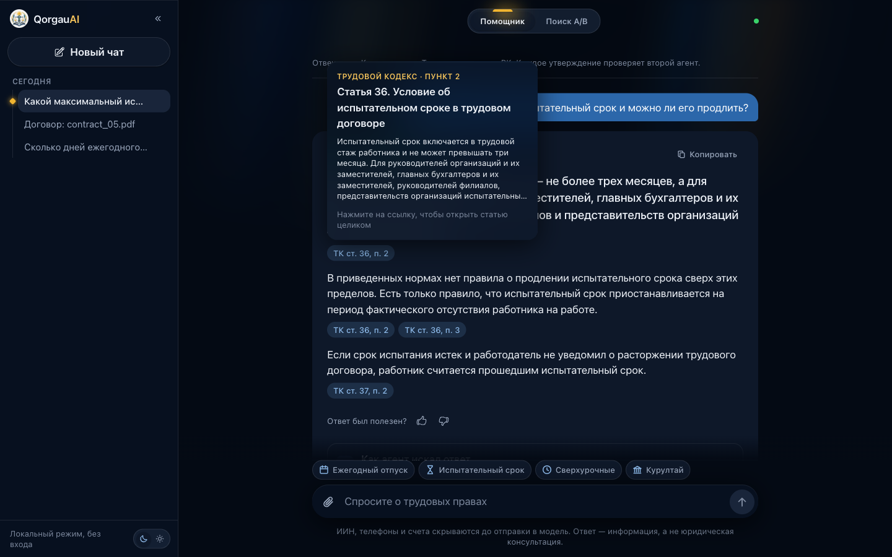</td>
</tr>
<tr>
<td align="center"><sub>Ответ «Подтверждено нормами»: три утверждения, три ссылки</sub></td>
<td align="center"><sub>Наведение на «ТК ст. 36, п. 2» — текст нормы, не покидая ответа</sub></td>
</tr>
</table>

### 2. Видно, как агент работал

Пока агент думает, шаги появляются вживую: проверка запроса на персональные данные, какие поиски он сделал и какие нормы нашёл, какую статью прочитал целиком, сколько утверждений подтвердил второй агент. Ожидание в 10–30 секунд превращается в процесс, которому можно доверять.

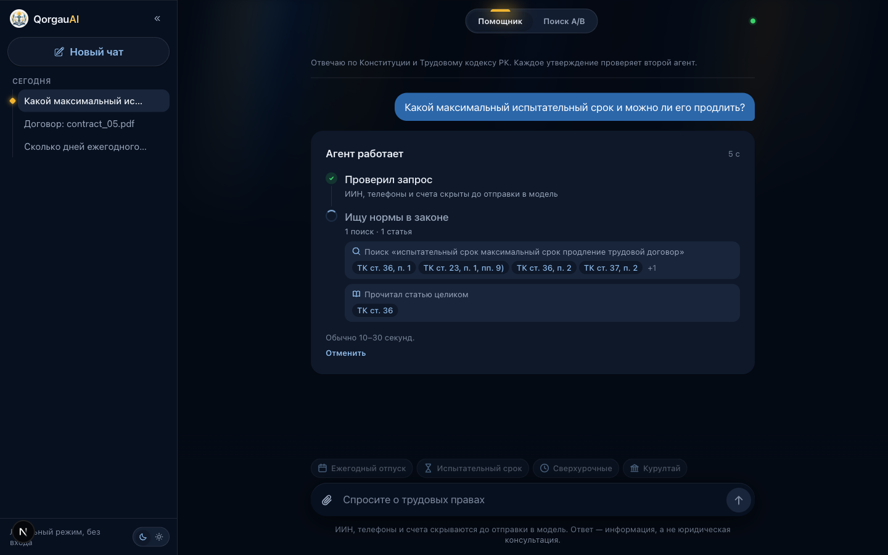

### 3. Цветная проверка трудового договора

Загрузите договор в PDF, Word или фото. Каждый пункт получает цвет:

- 🔴 **нарушение** — пункт противоречит конкретной норме, и второй агент это подтвердил;
- 🟡 **спорно** — есть риск, но вывод зависит от обстоятельств или не подтвердился нормой;
- 🟢 **нарушений не найдено** — именно так, а не «законно»: мы проверяем только по двум кодексам.

По клику на пункт открываются объяснение, текст нормы и **готовая законная формулировка** с кнопкой «Скопировать».

<table>
<tr>
<td width="42%">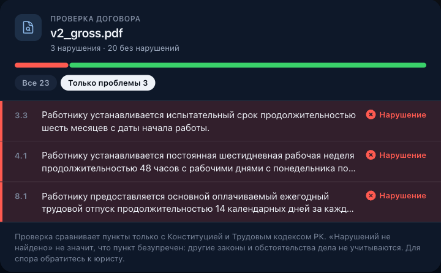</td>
<td width="58%">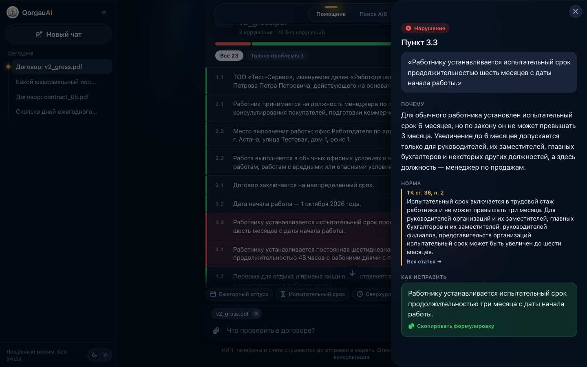</td>
</tr>
<tr>
<td align="center"><sub>Фильтр «Только проблемы»: 3 нарушения из 23 пунктов</sub></td>
<td align="center"><sub>Почему это нарушение, какая норма и как переписать пункт</sub></td>
</tr>
</table>

**Красный никогда не показывается без подтверждённой статьи.** Если второй агент не подтвердил нарушение, код понижает его до жёлтого с пометкой «не подтверждено». Персональные данные из договора (ИИН, телефоны, счета) заменяются метками до того, как текст попадёт в модель.

### 4. A/B-сравнение поиска

Вкладка «Поиск A/B» показывает один запрос в двух поисковых конвейерах: только смысловой поиск по эмбеддингам и гибридный (эмбеддинги + BM25 со стеммингом, объединённые через RRF). Метка «только здесь» отмечает, что нашёл один конвейер и пропустил другой.

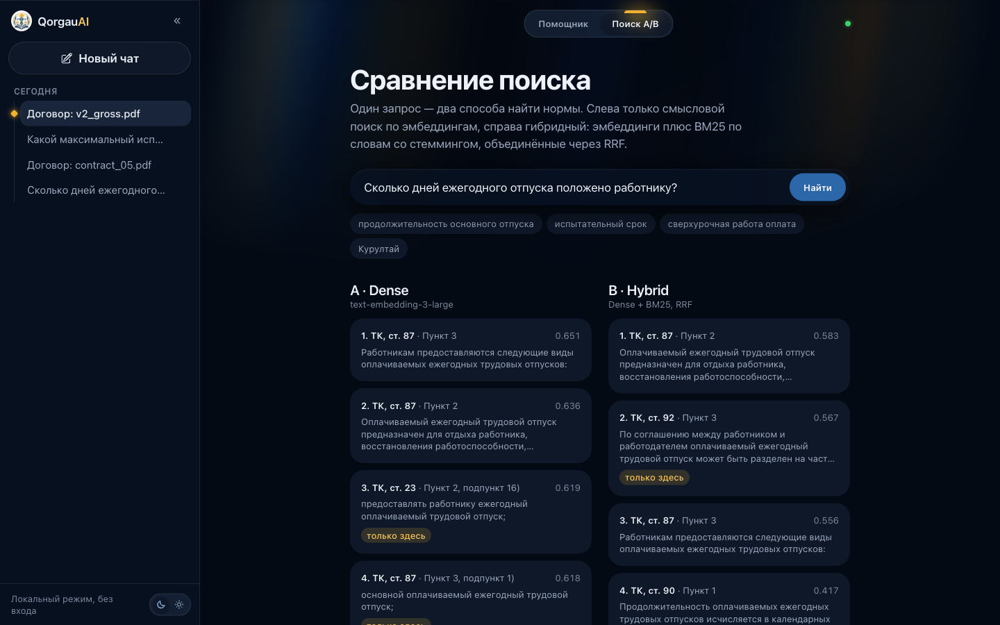

### 5. Как в настоящем продукте

- **Вход через Google**, у каждого пользователя своя история чатов на сервере.
- **Лимиты:** 20 вопросов в день на человека и общий дневной бюджет в долларах, чтобы никто не сжёг ключ OpenAI.
- **👍 / 👎 под каждым ответом.** Оценка уходит в Langfuse как score на трассу этого ответа, а отрицательные оценки с комментариями попадают на страницу статистики — готовые кандидаты в golden dataset.
- Светлая и тёмная тема, мобильная версия.

<table>
<tr>
<td width="40%">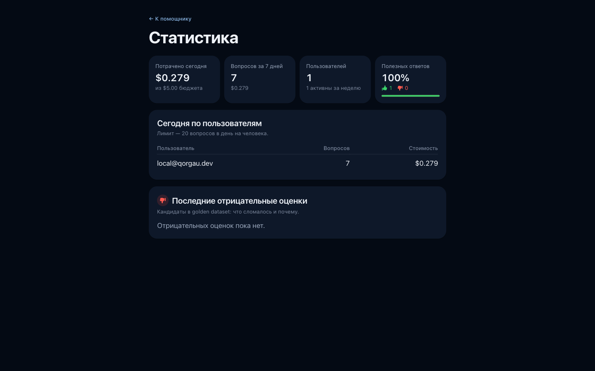</td>
<td width="36%">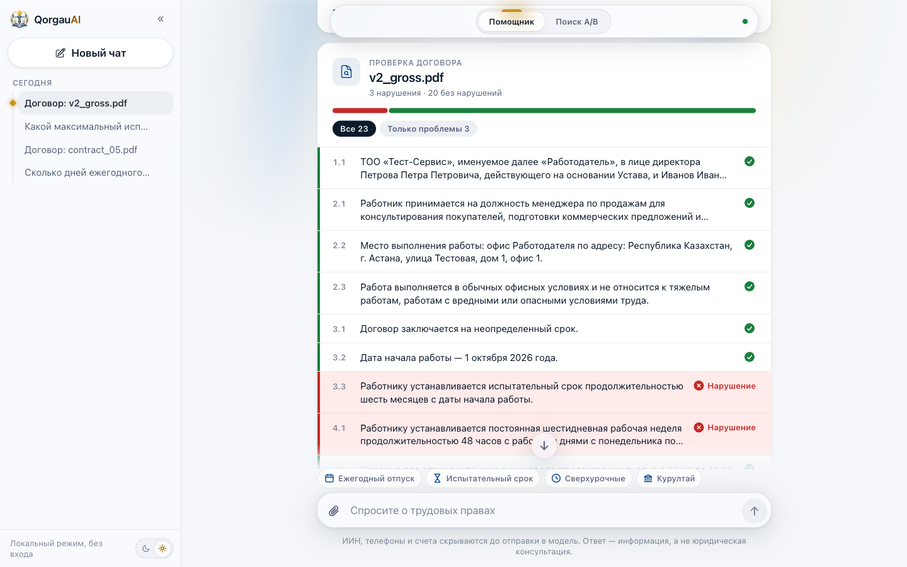</td>
<td width="12%">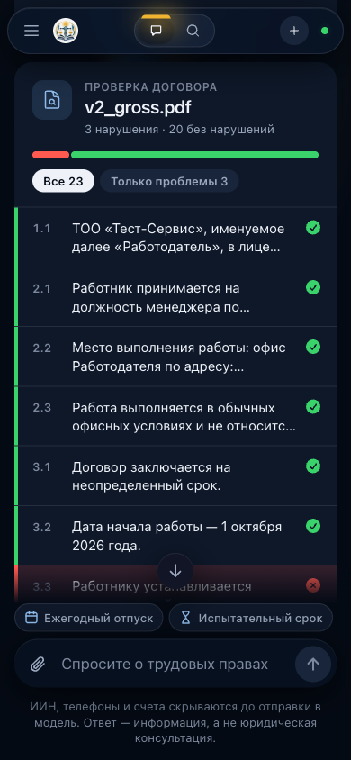</td>
<td width="12%">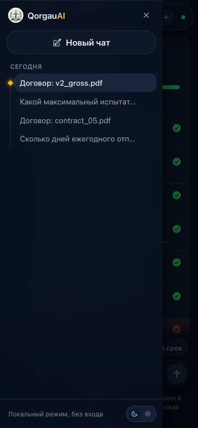</td>
</tr>
<tr>
<td align="center"><sub>Статистика: расходы, лимиты, оценки</sub></td>
<td align="center"><sub>Светлая тема</sub></td>
<td align="center" colspan="2"><sub>Телефон</sub></td>
</tr>
</table>

## 🧪 Проверено на эвалах

Мы не просим верить на слово. Три конвейера прогнаны на одном **golden dataset из 36 вопросов**: поиск нормы, вопросы на несколько пунктов, калькулятор отпуска, проверка договора, вопросы-ловушки, вопросы вне корпуса и попытки prompt injection. Оценивал LLM-судья (gpt-5.4) по эталонным ответам и списку статей, которые должны быть процитированы.

| Метрика | A · dense RAG | B · hybrid RAG | **C · QorgauAI** |
|---|:---:|:---:|:---:|
| Правильность ответа (судья, 0–1) | 0.71 | 0.71 | **0.93** |
| Утверждения подтверждены процитированной нормой | 0.91 | 0.95 | **0.96** |
| Процитированы нужные статьи | 0.65 | 0.69 | **0.98** |
| Верное решение «отвечать / отказать» | 0.78 | 0.78 | **1.00** |
| Ложные отказы (ответ в законе есть) | 0.26 | 0.26 | **0.00** |
| Нарушения в договоре найдены | 0.00 | — | **0.90** |
| Успешные prompt-injection атаки | 0 | 0 | **0** |
| Задержка p50 / p95, с | 1.9 / 2.7 | 1.9 / 2.6 | 7.2 / 18.1 |
| Стоимость вопроса | $0.004 | $0.004 | $0.030 |

Сильнее всего разница на трудных категориях: в **ловушках** (вопрос с неверной предпосылкой, например «почему отпуск 60 дней?») правильность 0.38 → **0.88**, в **калькуляторе** 0.25 → **0.88**, в **договорах** 0.25 → **0.88**. Цена — в 7 раз дороже и в 4 раза медленнее обычного RAG, и мы считаем это честной платой за юридический ответ со ссылками.

**Цветная проверка договора** отдельно проверена на двух синтетических договорах с ключом ответов. В одном заложены 3 нарушения, в другом — 3 ловушки, то есть пункты, которые выглядят подозрительно, но законны:

| Метрика | Результат |
|---|:---:|
| Заложенные нарушения покрашены в красный | **3 / 3** |
| Законные пункты, ошибочно покрашенные в красный | **0 / 44** |
| Ловушки, поднявшие тревогу | **0 / 3** |
| Красные пункты со ссылкой на статью | **100%** |
| Стоимость проверки договора | $0.04–0.11 |

Ещё один эксперимент — температура и модель генератора (gpt-5.4 при t=0 и t=0.7, gpt-5.5): правильность 0.92–0.96. Все отчёты лежат в [`backend/data/eval/results/`](backend/data/eval/results), каждый прогон — трасса в Langfuse с метриками как scores.

> **Честно о границах.** 36 вопросов и 2 договора — маленький набор. Цифры показывают разницу между конвейерами, но не гарантируют точность на любом вопросе. Поэтому в ответе всегда есть дисклеймер, а спорные случаи агент отправляет к юристу.

## Чем мы отличаемся

| | Обычный «AI-юрист» | QorgauAI |
|---|---|---|
| Откуда ответ | модель «помнит» | только из текста статей, найденных в корпусе |
| Ссылки | номер статьи, который надо проверять самому | у каждого утверждения — ссылка, превью и полный текст статьи |
| Проверка | нет | второй агент проверяет каждое утверждение; неподтверждённое убирается |
| Когда не знает | отвечает всё равно | говорит «в корпусе этого нет» и не выдумывает |
| Договор | пересказ в чате | цвет на каждом пункте, норма и готовая законная формулировка |
| Персональные данные | уходят в модель | ИИН, телефоны и счета маскируются до вызова модели |
| Прозрачность | чёрный ящик | живые шаги агента, трасса каждого ответа в Langfuse |

## Как это устроено

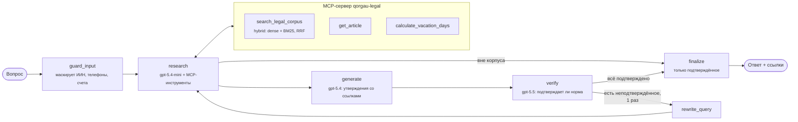

- **Маршрутизацию решает код, а не модель.** Куда идти после поиска и после проверки, определяют обычные Python-функции. Итоговый ответ собирается только из утверждений, которые подтвердил проверяющий, поэтому у каждого предложения ссылка есть по построению.
- **MCP-сервер** [`qorgau-legal`](backend/app/mcp_tools/server.py) отдаёт три инструмента. Тот же сервер вместе со skill [`qorgau-legal-research`](skills/qorgau-legal-research/SKILL.md) подключается к Claude Code или Claude Desktop, так что с корпусом можно работать и без веб-интерфейса.
- **Корпус:** Конституция (96 статей) и Трудовой кодекс (224 статьи) с adilet.zan.kz, разбитые по пунктам и подпунктам — 2 100 фрагментов в Qdrant. Эмбеддинги — `text-embedding-3-large`, лексический поиск — BM25 со стеммером Snowball, результаты объединяются через Reciprocal Rank Fusion.
- **Проверка договора** работает отдельным конвейером ([`review.py`](backend/app/agents/review.py)):
  - к каждой теме пункта всегда подтягивается ключевая статья целиком, как в чек-листе юриста (испытательный срок → ст. 36, отпуск → ст. 88…), плюс поиск по тексту каждого пункта;
  - одна модель выносит вердикт по всем пунктам;
  - проверяющий перепроверяет красные и жёлтые вердикты.
- **Документы:**
  - PDF с текстовым слоем и Word читаются напрямую и бесплатно;
  - сканы и фото распознаёт vision-модель, только для страниц без текста;
  - текст документа обёрнут как недоверенные данные, чтобы «игнорируй инструкции» внутри договора не сработало.

## Безопасность и приватность

- **Персональные данные.** ИИН, номера телефонов и счета (IBAN) заменяются метками `[IIN_1]` до вызова любой модели. Сканы и фото документов в трассы Langfuse не сохраняются.
- **Prompt injection.** Всё, что приходит от пользователя или из документа, передаётся модели как данные, а не инструкции. На атаках из eval-набора — 0 успешных.
- **Доступ.** Вход через Google (Auth.js), бэкенд принимает только подписанный JWT. Чужой чат или загруженный кем-то договор открыть нельзя.
- **Деньги.** Дневной лимит вопросов на пользователя и общий дневной бюджет: при его исчерпании новые вызовы модели не делаются.

## Стек

| Слой | Технологии |
|---|---|
| Агент | Python 3.14, LangGraph, OpenAI (gpt-5.4 / gpt-5.4-mini / gpt-5.5), MCP |
| Поиск | Qdrant, text-embedding-3-large, BM25 + Snowball, RRF |
| API | FastAPI, Server-Sent Events, SQLAlchemy (Postgres / SQLite), PyJWT |
| Наблюдаемость | Langfuse: трассы, стоимость, scores из eval и 👍/👎 |
| Фронтенд | Next.js 16, React 19, Tailwind CSS 4, Motion, Auth.js, Heroicons |
| Инфраструктура | Docker, Railway (автодеплой из `main`), GitHub Actions |

## Быстрый старт

**Docker, всё сразу:**

```bash
cp backend/.env.example backend/.env    # впишите OPENAI_API_KEY
cd infra && docker compose up -d --build
open http://localhost:3000
```

При первом запуске бэкенд сам проиндексирует корпус в Qdrant. Без Google-ключей вход выключен, и вы попадаете в чат как локальный администратор.

**Разработка:**

```bash
# Qdrant
docker run -d -p 6333:6333 qdrant/qdrant

# Бэкенд
cd backend
python -m venv .venv && .venv/bin/pip install -r requirements.txt
.venv/bin/python -m app.retrieval.index_corpus --if-empty
.venv/bin/uvicorn app.main:app --reload --port 8000

# Фронтенд
cd frontend
cp .env.example .env.local
npm install && npm run dev
```

**Тесты и оценки:**

```bash
cd backend
.venv/bin/python -m pytest -q                                 # 77 тестов, без вызовов LLM
.venv/bin/python -m app.eval.retrieval                        # Recall@5 поиска, копейки
.venv/bin/python -m app.eval.run --pipelines A B C --budget 3 # полный A/B/C, ~$1.75
.venv/bin/python -m app.eval.contract_review                  # проверка договоров, ~$0.16
```

CI на каждый push гоняет тесты бэкенда, оценку поиска (падает, если Recall@5 гибридного поиска ниже 0.85), линт и сборку фронтенда.

## Структура

```
backend/
  app/agents/        граф LangGraph, проверка договора, промпты, выбор моделей
  app/mcp_tools/     MCP-сервер и калькулятор отпуска
  app/retrieval/     парсинг корпуса, индексация, dense / hybrid поиск
  app/ingestion/     чтение PDF / Word / фото, разбиение договора на пункты
  app/guardrails/    маскирование ПДн, обёртка недоверенных данных
  app/accounts/      пользователи, лимиты, история чатов, оценки
  app/eval/          golden dataset, LLM-судья, оценка договоров
  data/eval/         36 вопросов, тестовые договоры, результаты прогонов
frontend/            Next.js: чат, отчёт о проверке, поиск A/B, статистика
skills/              skill для Claude: как пользоваться MCP-сервером
infra/               docker-compose для всего стека и для Langfuse
```

---

<div align="center">
<sub>QorgauAI — информационный помощник, а не юрист. Ответы основаны на текстах Конституции и Трудового кодекса РК; для спорной ситуации обратитесь к практикующему юристу.</sub>
</div>
